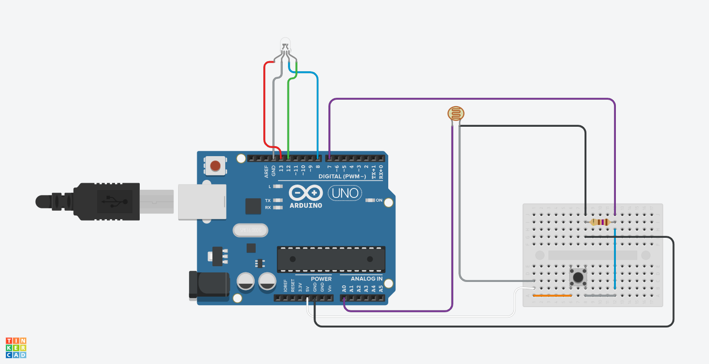

# IoT Surface Light-Dependant-Resistor
## Description

This project is a group effort / classroom project for the lecture: **Systems and Control Engineering - Technik und IoT**. The purpose of the project is to demonstrate the use of IoT devices in a practical application.

The task was to create an IoT device that measures and outputs the color of solid materials. Preferably surfaces. The timespan was around three weeks. 

## Team - DTintern
- Alina Simon
- Maximilian Flügel 
- Jannes Bikker 

# Usage

The IoT device can be accessed and used over the webinterface. But the Arduino device itself is required at all times.

## Prefabricated parts

| NAME | QUANTITY | COMPONENT      |
|------|----------|----------------|
| U1   | 1        | Arduino Uno R3 |
| U1   | 1        | Wifi Shield V2.0|
| D1   | 1        | LED RGB        |
| S1   | 1        | Pushbutton     |
| R1   | 1        | 169 Ω Resistor |
| R3   | 1        | Photoresistor  |

## General Design


## Webinterface


## Circuit Design


## Folder structure

```
.
├── README.md
├── iot-surface-ldr-arduino
│   └── src
│       └── ldr_surface_sensor.ino
├── iot-surface-ldr-frontend
│   ├── frontend.html
│   └── frontend_compressor.py
├── references
│   ├── measurements_black.csv
│   ├── measurements_white.csv
│   ├── plugs.txt
│   ├── proof_of_concept.ino
│   ├── reference_evaluator.py
│   ├── screenshot_annotated.gvdesign
│   └── screenshot_annotated.png
└── resources
    ├── IOT_sLDR_case.FCStd
    ├── circuit-design.png
    ├── parts.csv
    ├── surface-ldr-group6.pdf
    └── surface-ldr-group6.png

6 directories, 16 files
```

## References

- [PlatformIO](https://platformio.org/)
- [Jetbrains Clion PlatformIO](https://www.jetbrains.com/help/clion/platformio.html)
- [Chart.js](https://www.chartjs.org/)